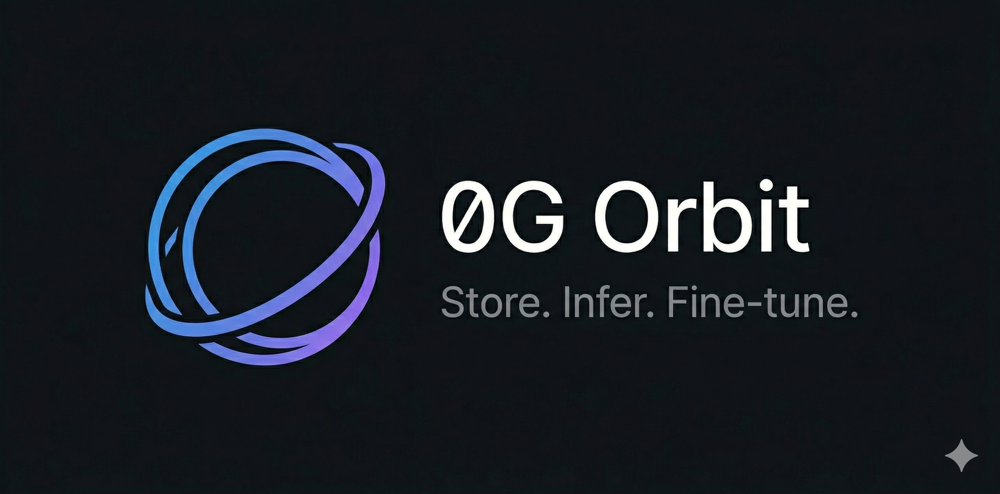

<p align="center">
  
</p>

<p align="center">
  <a href="https://www.npmjs.com/package/0g-orbit"></a>
  <a href="https://github.com/shaibuafeez/0g-orbit/actions/workflows/ci.yml"></a>
  <a href="https://opensource.org/licenses/MIT"></a>
  <a href="https://www.npmjs.com/package/0g-orbit"></a>
  <a href="https://nodejs.org"></a>
</p>

<p align="center">
  One SDK. One CLI. Five minutes to production on <a href="https://0g.ai">0G</a>.
</p>

---

## Why Orbit?

Building on 0G means juggling `@0gfoundation/0g-ts-sdk`, `@0glabs/0g-serving-broker`, and raw ethers calls. Orbit wraps all of it into a single `Orbit` class and a single `orbit` CLI.

- **Storage** — Upload and download files on 0G's decentralized storage network
- **Inference** — Run AI models on 0G's decentralized compute network
- **Fine-Tuning** — Upload datasets, train models, download results
- **CLI** — Do everything above from your terminal
- **Retry** — Automatic exponential backoff for transient failures
- **TypeScript** — Full type safety, ESM-native

## Install

```bash
npm install 0g-orbit
```

## Quick Start

```typescript
import { Orbit } from '0g-orbit'

const orbit = await Orbit.connect({
  network: 'testnet',
  privateKey: process.env.PRIVATE_KEY,
})

// Store a file
const { root } = await orbit.store('./data.json')

// Retrieve it
await orbit.retrieve(root, './downloaded.json')

// Run AI inference
const { content } = await orbit.infer('meta-llama/Llama-3.2-3B-Instruct', {
  message: 'Explain zero-knowledge proofs in one sentence.',
})

// Fine-tune a model
const dataset = await orbit.uploadDataset('./training-data.jsonl')
await orbit.createFineTuneTask({
  model: 'base-model',
  dataset: dataset.root,
  providerAddress: '0x...',
})
```

## CLI

```bash
export PRIVATE_KEY=0x...

orbit store ./my-file.txt                  # Upload a file
orbit retrieve <rootHash> ./output.txt     # Download a file
orbit infer llama-3.2 -m "Hello, 0G!"     # Run inference
orbit fine-tune ./data.jsonl --model base  # Fine-tune a model
orbit services                             # List AI services
orbit models                               # List base models
orbit tasks <provider>                     # Check fine-tune tasks
orbit status                               # Wallet balance & info
orbit init                                 # Scaffold a new project
```

## API Reference

### `Orbit.connect(config)`

| Option | Type | Default | Description |
|---|---|---|---|
| `network` | `'testnet' \| 'mainnet'` | — | Network to connect to |
| `privateKey` | `string` | `process.env.PRIVATE_KEY` | Wallet private key |
| `rpcUrl` | `string` | network default | Custom RPC endpoint |

### Storage

| Method | Returns | Description |
|---|---|---|
| `store(path, opts?)` | `{ root, txHash }` | Upload a file |
| `storeData(data, opts?)` | `{ root, txHash }` | Upload a string, Buffer, or Uint8Array |
| `retrieve(rootHash, path, opts?)` | `void` | Download a file by root hash |

### Inference

| Method | Returns | Description |
|---|---|---|
| `infer(model, opts)` | `{ content, tokensUsed }` | Run AI inference |
| `listServices()` | `ServiceInfo[]` | List available AI services |

### Fine-Tuning

| Method | Returns | Description |
|---|---|---|
| `uploadDataset(path)` | `{ root, txHash }` | Upload training data |
| `createFineTuneTask(opts)` | `FineTuneTask` | Start a fine-tuning job |
| `getFineTuneTask(provider, id)` | `FineTuneTask` | Check task status |
| `downloadModel(provider, id, dir)` | `void` | Download a fine-tuned model |
| `listModels()` | `FineTuneModel[]` | List available base models |
| `listProviders()` | `FineTuneProvider[]` | List fine-tuning providers |

### Direct Client Access

```typescript
orbit.storage      // StorageClient — low-level storage operations
orbit.inference    // InferenceClient — low-level inference operations
orbit.fineTuning   // FineTuningClient — low-level fine-tuning operations
```

## Networks

| Network | Chain ID | Status |
|---|---|---|
| Testnet | `16602` | Supported |
| Mainnet | `16661` | Supported |

## Security

This package has transitive vulnerabilities from upstream 0G SDKs. Add this to your project's `package.json` to mitigate:

```json
{
  "overrides": {
    "axios": "1.14.0"
  }
}
```

See [SECURITY.md](SECURITY.md) for details.

## Contributing

Contributions welcome. See [CONTRIBUTING.md](CONTRIBUTING.md) for setup instructions.

## License

[MIT](LICENSE)
